# GitFlow Strategy 
### A Guide for Agile Multi-Environment Development

## Table of Contents

**1. [Introduction](#1-introduction)**
- 1.1 [Key Principles](#11-key-principles)

**2. [Environment-Based GitFlow Strategies](#2-environment-based-gitflow-strategies)**
- 2.1 [The Power of Multi-Environment Testing](#21-the-power-of-multi-environment-testing)
- 2.2 [Environment Descriptions and Control](#22-environment-descriptions-and-control)
  - 2.2.1 [Development Environment: The Developer Sandbox](#221-development-environment-the-developer-sandbox)
  - 2.2.2 [QA Environment: Quality Validation Gateway](#222-qa-environment-quality-validation-gateway)
  - 2.2.3 [PreProduction Environment: Production Mirror](#223-preproduction-environment-production-mirror)
  - 2.2.4 [Production Environment: Live Business System](#224-production-environment-live-business-system)
- 2.3 [Why This Multi-Environment Strategy Creates Agility](#23-why-this-multi-environment-strategy-creates-agility)
  - 2.3.1 [Parallel Testing Streams](#231-parallel-testing-streams)
  - 2.3.2 [Faster Feedback Loops](#232-faster-feedback-loops)

**3. [Full GitFlow Strategy: The Foundation for Agile Development](#3-full-gitflow-strategy-the-foundation-for-agile-development)**
- 3.1 [Branch Structure](#31-branch-structure)
- 3.2 [Workflow Diagram](#32-workflow-diagram)
- 3.3 [Detailed GitFlow Process](#33-detailed-gitflow-process)
  - 3.3.1 [Sprint Initialization](#331-sprint-initialization)
  - 3.3.2 [Feature Development & Integration Process](#332-feature-development--integration-process)
  - 3.3.3 [Release Branch to PreProduction Deployment](#333-release-branch-to-preproduction-deployment)
  - 3.3.4 [Hotfixes During Pre-Production](#334-hotfixes-during-pre-production)
  - 3.3.5 [Production Deployment](#335-production-deployment)
- 3.4 [Full Environment and Features Development GitFlow Diagram](#34-full-environment-gitflow-diagram)

**4. [The Agility Advantage: Why Multi-Environment + Isolated Features Win](#4-the-agility-advantage-why-multi-environment--isolated-features-win)**
- 4.1 [QA Environment: The Feature Validation Gateway](#41-qa-environment-the-feature-validation-gateway)
  - 4.1.1 [Parallel Feature Validation](#411-parallel-feature-validation)
  - 4.1.2 [Independent Feature Approval](#412-independent-feature-approval)
- 4.2 [PreProduction Environment: The Regression Safety Net](#42-preproduction-environment-the-regression-safety-net)
  - 4.2.1 [Release Package Validation](#421-release-package-validation)
  - 4.2.2 [Parallel Development Streams](#422-parallel-development-streams)
- 4.3 [Feature Isolation: The Ultimate Development Agility](#43-feature-isolation-the-ultimate-development-agility)
  - 4.3.1 [Development Agility Benefits](#431-development-agility-benefits)
  - 4.3.2 [Release Agility Benefits](#432-release-agility-benefits)
- 4.4 [The Compound Agility Effect](#44-the-compound-agility-effect)
  - 4.4.1 [Real-World Agility Metrics](#441-real-world-agility-metrics)

**5. [Isolated Feature Strategy vs Traditional Integration Approach](#5-isolated-feature-strategy-vs-traditional-integration-approach)**
- 5.1 [The Problem with Traditional Integration Workflows](#51-the-problem-with-traditional-integration-workflows)
- 5.2 [Our Isolated Feature + Environment Integration + Selective Release Strategy](#52-our-isolated-feature--environment-integration--selective-release-strategy)
- 5.3 [Key Benefits of Isolated Feature Strategy](#53-key-benefits-of-isolated-feature-strategy)
  - 5.3.1 [Business Control Over Releases](#531-business-control-over-releases)
  - 5.3.2 [Risk Mitigation Through Selective Release Packaging](#532-risk-mitigation-through-selective-release-packaging)
  - 5.3.3 [Flexible Release Planning](#533-flexible-release-planning)
  - 5.3.4 [Independent Feature Lifecycle](#534-independent-feature-lifecycle)
- 5.4 [Real-World Scenarios](#54-real-world-scenarios)
  - 5.4.1 [Scenario 1: Last-Minute Business Change](#541-scenario-1-last-minute-business-change)
  - 5.4.2 [Scenario 2: Critical Bug Discovery](#542-scenario-2-critical-bug-discovery)
  - 5.4.3 [Scenario 3: Stakeholder Dependencies](#543-scenario-3-stakeholder-dependencies)
- 5.5 [Implementation Best Practices](#55-implementation-best-practices)
  - 5.5.1 [Clear Feature Approval Process](#551-clear-feature-approval-process)
  - 5.5.2 [Release Planning Meetings](#552-release-planning-meetings)
  - 5.5.3 [Feature Status Tracking](#553-feature-status-tracking)
  - 5.5.4 [Communication Protocol](#554-communication-protocol)
- 5.6 [Why This Strategy Wins](#56-why-this-strategy-wins)

**6. [Pull Request Strategy & Governance](#6-pull-request-strategy--governance)**
- 6.1 [Mandatory Pull Request Policy](#61-mandatory-pull-request-policy)
  - 6.1.1 [Protected Branches Configuration](#611-protected-branches-configuration)
  - 6.1.2 [Pull Request Approval Matrix](#612-pull-request-approval-matrix)
- 6.2 [Pull Request Templates](#62-pull-request-templates)
  - 6.2.1 [Feature to Environment PR Template](#621-feature-to-environment-pr-template)
  - 6.2.2 [Feature to Release PR Template](#622-feature-to-release-pr-template)
- 6.3 [Automated PR Workflows](#63-automated-pr-workflows)
  - 6.3.1 [Required Status Checks](#631-required-status-checks)
  - 6.3.2 [Branch-Specific Validations](#632-branch-specific-validations)
- 6.4 [PR Workflow Examples](#64-pr-workflow-examples)
  - 6.4.1 [Feature Integration Workflow](#641-feature-integration-workflow)
  - 6.4.2 [Release Preparation Workflow](#642-release-preparation-workflow)
- 6.5 [Emergency Hotfix PR Process](#65-emergency-hotfix-pr-process)
- 6.6 [Benefits of PR-Driven GitFlow](#66-benefits-of-pr-driven-gitflow)

**7. [Best Practices & Implementation Guidelines](#7-best-practices--implementation-guidelines)**
- 7.1 [Advantages of This GitFlow Strategy](#71-advantages-of-this-gitflow-strategy)
- 7.2 [Important Considerations](#72-important-considerations)
  - 7.2.1 [Branch Naming Conventions](#721-branch-naming-conventions)
  - 7.2.2 [Feature Branch Lifecycle](#722-feature-branch-lifecycle)
  - 7.2.3 [Release Management](#723-release-management)
- 7.3 [Why This Strategy Works for Any Team Size](#73-why-this-strategy-works-for-any-team-size)

**8. [Common Pitfalls & Solutions](#8-common-pitfalls--solutions)**
- 8.1 [Problem: Long-lived Feature Branches](#81-problem-long-lived-feature-branches)
- 8.2 [Problem: Merge Conflicts](#82-problem-merge-conflicts)
- 8.3 [Problem: Environment Drift](#83-problem-environment-drift)
- 8.4 [Problem: Release Bottlenecks](#84-problem-release-bottlenecks)

**9. [Migration Strategy](#9-migration-strategy)**
- 9.1 [Moving from Chaos to GitFlow](#91-moving-from-chaos-to-gitflow)
- 9.2 [Sample Migration Timeline](#92-sample-migration-timeline)

**10. [Conclusion](#10-conclusion)**
- 10.1 [Quick Decision Matrix](#101-quick-decision-matrix)

---

## 1. Introduction

This guide provides a comprehensive GitFlow strategy tailored for different environment configurations. The approach emphasizes controlled releases, proper testing at each stage, and flexibility in feature deployment decisions.

### 1.1 Key Principles
- **Main/Master branch**: Always reflects production-ready state
- **Feature isolation**: Each feature developed in isolation for easier management, **primarily living in local development environments**
- **Environment-specific testing**: Each environment serves a specific testing purpose
- **Release flexibility**: Features can be included/excluded from releases after development

---

## 2. Environment-Based GitFlow Strategy

### 2.1 The Power of Multi-Environment Testing

A robust GitFlow strategy requires **minimum three lower-level environments** (Development → QA → PreProduction → Production) to achieve true development and release agility. Each environment serves a critical purpose in the testing pyramid that enables faster, safer releases.


### 2.2 Environment Descriptions and Control

Understanding each environment's purpose and control structure is crucial for successful GitFlow implementation. Each environment serves distinct testing purposes and requires different levels of control and stability.

#### 2.2.1 Development Environment: The Developer Sandbox

**Purpose**: The development environment serves as the **developer's sandbox** - a controlled chaos environment where integration testing and feature experimentation happen freely.

**Who Controls It**: **Developers should have primary control** over the dev environment for maximum agility and productivity.

**Why Developer Control Matters**:

1. **Rapid Iteration Capability**
```bash
# Developers can deploy and test multiple times per day
git checkout dev
git merge feature/quick-fix
# Deploy immediately to dev environment
# Test, identify issues, fix, redeploy - all within hours
```

2. **Integration Testing Freedom**
- Test feature interactions without formal approval processes
- Experiment with different feature combinations
- Validate technical assumptions quickly
- Break things safely without impacting other environments

3. **Reduced Bottlenecks**
```
Traditional Approach: Developer → Submit → Wait for DevOps → Deploy → Test → Report Issues → Wait...
Our Approach: Developer → Deploy → Test → Fix → Redeploy (all within developer control)
```

**Development Environment Characteristics**:
- **Stability**: Low (expected to be unstable during active development)
- **Data**: Synthetic test data, can be reset frequently
- **Deployment**: Multiple deployments per day, automated from dev branch
- **Access**: All developers have deployment access
- **Monitoring**: Basic error logging, performance monitoring optional
- **Uptime**: Not critical, can be down during development hours

**Benefits of Developer-Controlled Dev Environment**:

| Benefit | Impact | Example |
|---------|--------|---------|
| **Fast Feedback Loops** | Issues caught in minutes, not days | Deploy → Test → Fix cycle in 30 minutes |
| **Risk-Free Experimentation** | Try bold approaches safely | Test new architecture patterns |
| **Independent Development** | No blocking dependencies | Work on Feature A while Feature B is broken |
| **Learning Environment** | Safe place to make mistakes | Junior developers can experiment |
| **Integration Validation** | Catch integration issues early | See how Feature A + B + C work together |

#### 2.2.2 QA Environment: Quality Validation Gateway

**Purpose**: Formal quality assurance testing with stable, controlled feature sets for systematic validation.

**Who Controls It**: **QA Team with Developer Support** - QA team controls what gets tested when, developers support deployment and issue resolution.

**QA Environment Characteristics**:
- **Stability**: High (changes only through approved merges)
- **Data**: Stable test datasets that mirror production scenarios
- **Deployment**: Planned deployments, usually 1-2 times per day
- **Access**: QA team has testing access, developers have diagnostic access
- **Monitoring**: Comprehensive error tracking, test automation results
- **Uptime**: High priority during business hours

**Why QA Control is Essential**:
- **Systematic Testing**: QA can test complete workflows without interruption
- **Consistent Test Environment**: No surprise changes that invalidate test results
- **Defect Reproduction**: Stable environment for reproducing and debugging issues
- **Acceptance Criteria Validation**: Business requirements validated in controlled setting

#### 2.2.3 PreProduction Environment: Production Mirror

**Purpose**: Final validation in production-like conditions with complete release packages.

**Who Controls It**: **DevOps/Release Team** - Strict control to mirror production conditions exactly.

**PreProduction Environment Characteristics**:
- **Stability**: Very High (mirrors production)
- **Data**: Production-like datasets (anonymized)
- **Deployment**: Formal release deployments only
- **Access**: Limited to DevOps and senior developers
- **Monitoring**: Production-level monitoring and alerting
- **Uptime**: Production-level availability requirements

**Why DevOps Control is Critical**:
- **Production Parity**: Exact match to production infrastructure and processes
- **Security Validation**: Same security controls as production
- **Performance Validation**: Real-world performance testing
- **Deployment Process Validation**: Test exact production deployment procedures

#### 2.2.4 Production Environment: Live Business System

**Purpose**: Live system serving real users with maximum stability and availability.

**Who Controls It**: **DevOps/Operations Team** - Highest level of control and governance.

**Production Environment Characteristics**:
- **Stability**: Maximum (changes only through formal release process)
- **Data**: Real business data with full security controls
- **Deployment**: Formal, scheduled, with rollback procedures
- **Access**: Restricted to operations team and emergency responders
- **Monitoring**: Comprehensive real-time monitoring, alerting, and logging
- **Uptime**: Maximum availability with SLA requirements

### 2.3 Why This Multi-Environment Strategy Creates Agility

#### 2.3.1 Parallel Testing Streams
With dedicated environments, different types of testing happen simultaneously:
- **Dev Environment**: Continuous integration testing of new features
- **QA Environment**: Formal testing of stable features  
- **PreProd Environment**: Regression testing of complete release packages

This parallelization means **QA can test Feature A while Dev integrates Feature B**, and **PreProd can regression test Release 1.0 while QA validates features for Release 1.1**.

#### 2.3.2 Faster Feedback Loops


Compare this to single-environment testing where each step blocks the next, creating weeks-long cycles.

---

## 3. Full GitFlow Strategy: The Foundation for Agile Development
### (Development → QA → PreProduction → Production)

This comprehensive setup is essential for teams that need to balance development speed with release quality and business flexibility. The four-environment approach creates multiple feedback loops that actually **increase** development velocity rather than slow it down.

### 3.1 Branch Structure

| Branch Type | Purpose | Environment | Lifespan | Primary Location |
|------------|---------|-------------|----------|------------------|
| `main/master` | Production-ready code | Production | Permanent | Remote |
| `pp` | Pre-production testing | PreProduction | Sprint-based | Remote |
| `qa` | Quality assurance testing | QA | Sprint-based | Remote |
| `dev` | Development integration | Development | Sprint-based | Remote |
| `release/v.x.x.x` | Release packages | PreProduction | Release-based | Remote |
| `feature/*` | Individual features | **Local Development** | Feature-based | **Primarily Local** |
| `fix/*` | Bug fixes for releases | Various | Fix-based | Local + Remote |

**Important Note**: `feature/*` branches **live primarily in local development environments** and are pushed to remote only for Pull Request creation and collaboration. This keeps the remote repository clean and focuses on integration points rather than work-in-progress code.

### 3.2 Workflow Diagram

```mermaid
graph TD
    A[Sprint Start] --> B[Reset pp, qa, dev to main]
    B --> C[Create release/v.x.x.x from main]
    C --> D[Create feature branches from main - LOCAL DEVELOPMENT]
    D --> E[Develop features locally]
    
    E --> F[PR: feature → dev]
    F --> G[Test & integrate in dev environment]
    G --> H[PR: feature → qa]
    H --> I[QA testing in qa environment]
    
    I --> J{Feature approved for release?}
    J -->|Yes| K[PR: feature → release branch]
    J -->|No| L[Hold feature for next release - stays local]
    
    K --> M{All release features ready?}
    M -->|No| N[Continue with next feature]
    N --> H
    M -->|Yes| O[PR: release branch → pp]
    O --> P[PreProd testing]
    P --> Q{Issues found in pp?}
    Q -->|Yes| R[Create fix branch]
    R --> S[Fix and merge to release]
    S --> O
    Q -->|No| T[PR: release branch → main]
    T --> U[Deploy to production]
```



### 3.3 Detailed GitFlow Process

#### 3.3.1 Sprint Initialization
**Purpose**: Reset all environment branches to production state and create a new release branch for the upcoming sprint. This ensures all environments start clean and synchronized with the current production code.

**Note**: Sprint initialization is one of the few operations that may be performed directly by DevOps/Tech Lead with proper documentation and team notification.

```bash
# At the beginning of each sprint (performed by DevOps/Tech Lead)
git checkout main
git pull origin main

# Reset environment branches (document in sprint planning notes)
git checkout pp && git reset --hard main && git push --force origin pp
git checkout qa && git reset --hard main && git push --force origin qa  
git checkout dev && git reset --hard main && git push --force origin dev

# Create new release branch
git checkout -b release/v.1.2.3 main
git push origin release/v.1.2.3

# Notify team of sprint initialization completion
```

#### 3.3.2 Feature Development & Integration Process
**Purpose**: Each feature goes through integration and testing at every environment level (dev → qa → optional pp testing), but the release branch is built by selectively merging only business-approved features. This ensures features are tested in each environment while maintaining selective release control.

**⚠️ IMPORTANT**: All merges to environment branches (dev, qa, pp) and release branches must be performed through **Pull Requests (PRs)** - never direct merges.

```bash
# Step 1: Create feature branch from main - LIVES PRIMARILY LOCAL
git checkout main
git pull origin main
git checkout -b feature/TASK-123-user-authentication

# Step 2: Local development (feature branch stays local during development)
# ... extensive local development, commits, testing ...

# Step 3: After local development completion, push and create PR to dev
git push origin feature/TASK-123-user-authentication
# Create PR: feature/TASK-123-user-authentication → dev
# PR Review: Code review by dev team lead or senior developer
# PR Merge: After approval, merge via GitHub/GitLab interface
# Deploy to dev environment for integration testing with other features

# Step 4: After successful dev integration, create PR to qa
# Create PR: feature/TASK-123-user-authentication → qa  
# PR Review: Code review by QA lead and/or technical lead
# PR Merge: After approval, merge via GitHub/GitLab interface
# Deploy to QA environment for formal QA testing

# Step 5: (Optional) If feature needs pp-level testing before release decision
# Create PR: feature/TASK-123-user-authentication → pp
# PR Review: Code review by senior developer or architect
# PR Merge: After approval, merge via GitHub/GitLab interface
# Deploy to PreProd for advanced testing if needed

# Step 6: After QA approval and business approval for release
# Create PR: feature/TASK-123-user-authentication → release/v.1.2.3
# PR Review: Code review by tech lead + business approval documented
# PR Merge: After approval, merge via GitHub/GitLab interface

# Step 7: Clean up - delete feature branch from remote (keep local until release)
git push origin --delete feature/TASK-123-user-authentication
```

#### 3.3.3 Release Branch to PreProduction Deployment
**Purpose**: Deploy the complete release package (containing only selected approved features) to an environment identical to production for final validation. The release branch acts as the single source of truth for what will be deployed to production.

```bash
# When all approved features are merged to release branch via PRs
git checkout pp
git pull origin pp
git reset --hard main  # Reset pp to clean production state

# Create PR: release/v.1.2.3 → pp
# PR Review: Review by senior developer/architect + DevOps approval
# PR Merge: After approval, merge via GitHub/GitLab interface

# Deploy release package to pre-production for E2E and stress testing
```

#### 3.3.4 Hotfixes During Pre-Production
**Purpose**: Address critical issues discovered during pre-production testing without disrupting the main development flow. Fixes are applied directly to the release branch and then re-tested to ensure they don't introduce new problems.

```bash
# If issues found in pre-production
git checkout release/v.1.2.3
git pull origin release/v.1.2.3
git checkout -b fix/critical-security-issue

# After fixing the issue locally
git push origin fix/critical-security-issue

# Create PR: fix/critical-security-issue → release/v.1.2.3
# PR Review: Code review by senior developer + security review if needed
# PR Merge: After approval, merge via GitHub/GitLab interface

# Create PR to re-deploy to pre-production: release/v.1.2.3 → pp
# PR Review: Review by DevOps/senior developer  
# PR Merge: After approval, merge via GitHub/GitLab interface
# Re-deploy and perform tests again
```

#### 3.3.5 Production Deployment
**Purpose**: Deploy the thoroughly tested release branch (containing only approved features) to production. The release branch becomes the new production state, and individual features that were tested separately are now released as a cohesive package.

```bash
# After successful pre-production testing of release branch
git checkout main
git pull origin main

# Create PR: release/v.1.2.3 → main
# PR Review: Final review by tech lead + DevOps + business stakeholder sign-off
# PR Merge: After all approvals, merge via GitHub/GitLab interface

# Tag the release after merge
git checkout main  
git pull origin main
git tag v.1.2.3
git push origin --tags

# Deploy release package to production via CI/CD pipeline
```

### 3.4 Full Environment and Features Development GitFlow Diagram

From above graph you can notice how all features are developed in isolation and merged into Dev and QA for validation. Although all features were tested in QA, **only approved ones (auth and payment)** were promoted into the release package (release/v1.0.1). The **fed-auth** feature, despite being developed and validated, it was not approved for delivery and therefore excluded from the release branch. Approved features then flow through Pre-Production for regression and ultimately to Production.

---

## 4. The Agility Advantage: Why Multi-Environment + Isolated Features Win

### 4.1 QA Environment: The Feature Validation Gateway

The QA environment serves as the **feature validation gateway** where individual features prove their worth before being considered for release. This creates incredible agility because:

#### 4.1.1 Parallel Feature Validation
```bash
# Multiple features being validated simultaneously
# QA Environment State:
git checkout qa
git log --oneline
# Contains: feature/auth + feature/payment + feature/notifications
# Each feature tested independently within integrated environment
```

**The Agility Impact**: While QA tests Feature A (2 days), development continues on Features D, E, F. No waiting, no blocking.

#### 4.1.2 Independent Feature Approval
```
Day 1: Feature A enters QA testing
Day 2: Feature B enters QA testing  
Day 3: Feature A passes QA → approved for release
Day 4: Feature C enters QA testing
Day 5: Feature B fails QA → back to dev, but doesn't affect Feature A's release
```

**Traditional Approach**: All features wait for the slowest one
**Our Approach**: Fast features move ahead, slow features don't block others

### 4.2 PreProduction Environment: The Regression Safety Net

PreProduction environment enables **regression testing agility** by providing a production-like environment for complete release package validation:

#### 4.2.1 Release Package Validation
```bash
# PreProd contains ONLY the approved release package
git checkout pp  
git reset --hard main  # Clean slate
git merge release/v.1.2.3  # Only approved features
```

**The Agility Impact**: 
- **QA continues testing new features** for next release while **PreProd validates current release**
- **Regression testing happens in parallel** with feature development
- **Production deployments become predictable** because PreProd matches production exactly

#### 4.2.2 Parallel Development Streams
```
Timeline Example:
Week 1: Dev (Features A,B,C) | QA (Previous Features) | PreProd (Release 1.0)
Week 2: Dev (Features D,E,F) | QA (Features A,B,C) | PreProd (Release 1.1) 
Week 3: Dev (Features G,H,I) | QA (Features D,E,F) | PreProd (Release 1.2)
```

**Result**: Three development streams running simultaneously instead of sequential bottlenecks.

### 4.3 Feature Isolation: The Ultimate Development Agility

Feature isolation combined with selective release packaging creates unprecedented development agility:

#### 4.3.1 Development Agility Benefits

1. **No Feature Dependencies**
```bash
# Features developed independently in local environments
feature/user-auth      # Ready in 3 days (local development)
feature/payment-api    # Ready in 7 days (local development)
feature/reporting      # Ready in 12 days (local development)

# Traditional: Wait 12 days for all
# Our approach: Release user-auth in 3 days if business approves
```

2. **Risk-Free Experimentation**
```bash
# Developer can try bold approaches knowing:
# - Feature stays local during development
# - Won't accidentally reach production
# - Other features won't be affected by experimental code
# - Can be easily excluded from release if problems arise
```

3. **Flexible Release Planning**
```bash
# Business can make last-minute decisions without technical debt
# Sprint planning: "Include features A, B, C in release"
# Week 2: "Actually, hold feature C for legal review"
# No problem: Simply don't merge feature C to release branch
```

#### 4.3.2 Release Agility Benefits

1. **Market Responsiveness**
```
Scenario: Competitor launches similar feature to our Feature X
Decision: Release Features Y and Z immediately, hold Feature X
Implementation: Don't merge feature/X to release branch
Time to implement: 0 minutes (just skip the merge)
```

2. **Quality Gating Without Blocking**
```
Scenario: Feature A has minor UI issue, Features B & C are perfect
Traditional: Fix A first, then release all together (delay)
Our approach: Release B & C now, fix A for next release (no delay)
```

3. **Stakeholder Flexibility**
```
Scenario: Marketing wants Feature A in release, Sales wants Feature B
Solution: Include both if both pass QA, or include the one that's ready
No technical barriers to business decisions
```

### 4.4 The Compound Agility Effect

When you combine **multi-environment testing** with **isolated features** and **selective release packaging**, you get compound agility benefits:


#### 4.4.1 Real-World Agility Metrics

| Metric | Traditional Approach | Our GitFlow Strategy |
|--------|---------------------|---------------------|
| **Feature to Production Time** | 4-6 weeks | 1-2 weeks |
| **Hotfix Deployment Time** | 2-3 days | 2-4 hours |
| **Release Flexibility** | All-or-nothing | Pick and choose |
| **Development Blocking** | High (features block each other) | Low (isolated development) |
| **QA Efficiency** | Sequential testing | Parallel validation |
| **Regression Testing** | Blocks new development | Parallel to development |
| **Business Decision Speed** | Slow (technical constraints) | Fast (no technical barriers) |

---

## 5. Isolated Feature Strategy vs Traditional Integration Approach

### 5.1 The Problem with Traditional Integration Workflows

Most teams follow a **"integration-first"** approach where they:
1. Merge all completed features to dev/qa branches
2. Create releases directly from these integrated branches
3. **Risk**: All features in dev/qa automatically go to production, whether intended or not

```mermaid
graph TD
    A[Feature A Complete] --> B[Merge to Dev]
    C[Feature B Complete] --> B
    D[Feature C Complete] --> B
    B --> E[All Features Now in Dev/QA]
    E --> F[Create Release from Dev/QA Branch]
    F --> G[ALL FEATURES Go to Production]
    G --> H[😱 Unintended Feature Release!]
```



### 5.2 Our Isolated Feature + Environment Integration + Selective Release Strategy

Our approach uses **"integration per environment + selective packaging"** where:
1. Features are integrated into EACH environment branch (dev, qa, pp) for proper testing
2. Integration branches (dev/qa/pp) are used for testing and validation
3. **Release branches are built by consciously selecting approved features**
4. **Business control**: Only approved features make it to production


### 5.3 Key Benefits of Isolated Feature Strategy

#### 5.3.1 Business Control Over Releases
```bash
# Traditional approach - ALL features go to production
git checkout main
git merge dev  # Everything in dev goes live!

# Our approach - SELECTIVE features go to production
git checkout release/v.1.2.3
git merge feature/approved-feature-A    # ✅ Business approved
git merge feature/approved-feature-C    # ✅ Business approved
# feature/feature-B stays out - not ready for release
```

#### 5.3.2 Risk Mitigation Through Selective Release Packaging
- **Scenario**: Feature B has a critical bug discovered during QA testing
- **Traditional**: All features in qa branch are blocked - entire release delayed
- **Our approach**: Feature B was tested in qa but isn't merged to release branch - other approved features proceed on schedule

**Example**:
```bash
# Features A, B, C all tested in qa branch
git checkout qa  # Contains: Feature A + B + C

# Feature B has critical bug, but A and C are solid
# Traditional: entire qa branch blocked
# Our approach: selective release building
git checkout release/v.1.2.3
git merge feature/A  # ✅ Approved
git merge feature/C  # ✅ Approved  
# Skip feature/B - ❌ Has bug, will go to next release
```

#### 5.3.3 Flexible Release Planning
```bash
# Week 1: Features A, B, C complete development (locally)
# Week 2: All features pass QA testing
# Week 3: Business decides:
#   - Feature A: Include (market ready)
#   - Feature B: Include (customer requested) 
#   - Feature C: Hold (waiting for legal approval)

# Result: Release contains only A and B
git checkout release/v.1.2.3
git merge feature/TASK-123-feature-A
git merge feature/TASK-124-feature-B
# Feature C waits for next release
```

#### 5.3.4 Independent Feature Lifecycle
Each feature maintains its own lifecycle independent of others:

| Feature | Development | QA Status | Business Decision | Release Status |
|---------|------------|-----------|-------------------|----------------|
| User Auth | ✅ Complete | ✅ Passed | ✅ Approved | 🚀 Released v1.2.3 |
| Payment API | ✅ Complete | ✅ Passed | ⏳ Hold (legal review) | 📋 Next Release |
| Dashboard | ✅ Complete | ❌ Failed | N/A | 🔄 Back to Dev |
| Notifications | ✅ Complete | ✅ Passed | ✅ Approved | 🚀 Released v1.2.3 |

### 5.4 Real-World Scenarios

#### 5.4.1 Scenario 1: Last-Minute Business Change
```
Sprint Goal: Release features A, B, C
Day 8 of 10: Marketing says "Hold feature C, competitor just launched similar"

Traditional Approach:
- Panic mode
- Either delay release or emergency rollback planning
- Risk of breaking changes while removing feature

Our Approach:
- Simply don't merge feature/C to release branch
- Release A and B on schedule
- Feature C remains ready for future release (kept locally)
```

#### 5.4.2 Scenario 2: Critical Bug Discovery
```
Pre-production testing: Feature B has security vulnerability

Traditional Approach:
- Fix in dev/qa branch affects all features
- Risk of introducing new bugs in features A and C
- Potential cascade of testing delays

Our Approach:
- Create fix/security-issue branch from feature/B
- Test fix in isolation
- If fix works: merge to release
- If fix needs time: exclude feature B, release A and C
```

#### 5.4.3 Scenario 3: Stakeholder Dependencies
```
Features ready: User Registration, Email Verification, Profile Management
Stakeholder: "We can't launch Profile Management until new privacy policy is approved"

Traditional Approach:
- All features stuck waiting for legal approval
- Development team idle or working around constraints

Our Approach:
- Release User Registration and Email Verification
- Profile Management waits for legal approval in next release
- Team continues normal development velocity
```

### 5.5 Implementation Best Practices

#### 5.5.1 Clear Feature Approval Process
```bash
# Document approval status in commit messages
git commit -m "feat: user authentication - APPROVED for release v.1.2.3"
git commit -m "feat: advanced analytics - ON HOLD (performance concerns)"
```

#### 5.5.2 Release Planning Meetings
Hold "Feature Selection" meetings before merging to release branch:
- Review all QA-passed features
- Make business decisions on inclusion
- Document decisions for audit trail

#### 5.5.3 Feature Status Tracking
| Branch Name | Jira Ticket | Dev Status | QA Status | Business Status | Target Release |
|-------------|-------------|------------|-----------|----------------|----------------|
| feature/AUTH-123 | AUTH-123 | ✅ | ✅ | ✅ Approved | v.1.2.3 |
| feature/PAY-456 | PAY-456 | ✅ | ✅ | ⏳ Legal Review | v.1.3.0 |
| feature/DASH-789 | DASH-789 | ✅ | ❌ Bug found | N/A | TBD |

#### 5.5.4 Communication Protocol
```bash
# Tag approved features
git tag business-approved/v.1.2.3 feature/AUTH-123
git tag business-approved/v.1.2.3 feature/NOTIF-456

# Document excluded features
git tag hold-for-legal feature/PAY-789
git tag needs-rework feature/DASH-101
```

### 5.6 Why This Strategy Wins

1. **Predictable Releases**: Only intended features reach production
2. **Reduced Risk**: Problematic features don't block others
3. **Business Agility**: Can respond to market changes quickly
4. **Developer Peace of Mind**: Completed work isn't lost due to other team's issues
5. **Quality Assurance**: Each feature tested in isolation and integration
6. **Audit Trail**: Clear record of what was included and why

This approach transforms development from "all or nothing" releases to "selective, strategic" deployments that align with business objectives while maintaining technical quality.

---

## 6. Pull Request Strategy & Governance

### 6.1 Mandatory Pull Request Policy

**🚨 CRITICAL RULE**: No direct merges are allowed to any environment or release branches. All integrations must go through Pull Requests for proper governance, code quality, and audit trails.

#### 6.1.1 Protected Branches Configuration
Configure your Git platform (GitHub/GitLab/Bitbucket) with these branch protection rules:

| Branch Type | Branch Names | Protection Rules |
|-------------|-------------|------------------|
| **Production** | `main`, `master` | • Require PR<br/>• Require 2+ approvals<br/>• Require status checks<br/>• No force push<br/>• No deletion |
| **Release** | `release/*` | • Require PR<br/>• Require 1+ approval<br/>• Require status checks<br/>• No force push |  
| **Environment** | `dev`, `qa`, `pp` | • Require PR<br/>• Require 1+ approval<br/>• Allow force push (sprint resets)<br/>• No deletion |

#### 6.1.2 Pull Request Approval Matrix

| Source → Target | Required Reviewers | Additional Requirements |
|----------------|-------------------|------------------------|
| `feature/*` → `dev` | 1 senior developer | • All tests pass<br/>• No merge conflicts |
| `feature/*` → `qa` | 1 QA lead or tech lead | • Dev integration successful<br/>• Feature complete |
| `feature/*` → `pp` | 1 senior developer/architect | • QA testing complete<br/>• Performance considerations reviewed |
| `feature/*` → `release/*` | 1 tech lead + business approval | • QA approved<br/>• Business sign-off documented |
| `release/*` → `pp` | 1 senior developer + DevOps | • All features integrated<br/>• Deployment plan reviewed |
| `release/*` → `main` | 2+ approvals (tech lead + DevOps + business) | • PreProd testing complete<br/>• Deployment checklist completed<br/>• Rollback plan documented |
| `fix/*` → `release/*` | 1+ senior developer | • Issue validated<br/>• Fix tested |

### 6.2 Pull Request Templates

#### 6.2.1 Feature to Environment PR Template
```markdown
## Feature Integration Request

**Feature**: [Feature Name/JIRA Ticket]
**Target Environment**: [dev/qa/pp]
**Developer**: [Your Name]
**Review Type**: [Integration/QA/PreProd]

### Changes
- [ ] New feature implementation
- [ ] Bug fixes  
- [ ] Configuration changes
- [ ] Database migrations

### Testing Completed
- [ ] Unit tests pass
- [ ] Integration tests pass
- [ ] Manual testing completed
- [ ] No breaking changes

### Deployment Notes
- [ ] Database migrations required: [Yes/No]
- [ ] Environment variables needed: [List]
- [ ] Third-party service changes: [List]

### Reviewer Checklist
- [ ] Code follows team standards
- [ ] No security vulnerabilities
- [ ] Performance impact considered
- [ ] Documentation updated
```

#### 6.2.2 Feature to Release PR Template
```markdown
## Release Integration Request

**Feature**: [Feature Name/JIRA Ticket]  
**Release Version**: [v.x.x.x]
**Business Owner**: [Name]
**Technical Lead**: [Name]

### Business Approval
- [ ] Feature approved by Product Owner: [Name, Date]
- [ ] Business acceptance criteria met
- [ ] Legal/Compliance review completed (if required)
- [ ] Marketing/Sales team notified

### Technical Validation  
- [ ] Development integration successful
- [ ] QA testing completed and approved
- [ ] Performance testing completed (if required)
- [ ] Security review completed (if required)

### Release Impact
- [ ] Breaking changes: [None/List]
- [ ] Database migrations: [None/List]  
- [ ] API changes: [None/List]
- [ ] Configuration updates: [None/List]

### Documentation
- [ ] Release notes updated
- [ ] User documentation updated  
- [ ] Technical documentation updated
- [ ] Rollback procedures documented
```

### 6.3 Automated PR Workflows

#### 6.3.1 Required Status Checks
Configure automated checks that must pass before PR can be merged:

```yaml
# Example GitHub Actions workflow
name: PR Validation
on:
  pull_request:
    branches: [dev, qa, pp, 'release/*', main]

jobs:
  validate:
    runs-on: ubuntu-latest
    steps:
      - name: Run Tests
        run: npm test
      
      - name: Security Scan  
        run: npm audit
        
      - name: Code Quality Check
        run: npm run lint
        
      - name: Build Validation
        run: npm run build
        
      - name: Integration Tests
        if: contains(github.base_ref, 'dev')
        run: npm run test:integration
```

#### 6.3.2 Branch-Specific Validations

| Target Branch | Required Checks |
|---------------|----------------|
| `dev` | Unit tests, linting, build |
| `qa` | Unit tests, integration tests, security scan |
| `pp` | Full test suite, performance benchmarks |
| `release/*` | Full test suite, security scan, documentation check |
| `main` | All checks + manual approval workflow |

### 6.4 PR Workflow Examples

#### 6.4.1 Feature Integration Workflow
```bash
# Developer workflow - feature stays local during development
git checkout main
git pull origin main
git checkout -b feature/USER-123-login-enhancement

# ... extensive local development work ...

# Push and create PR only when ready for integration
git push origin feature/USER-123-login-enhancement
# Open PR: feature/USER-123-login-enhancement → dev

# After PR approval and merge, feature is in dev
# Repeat for qa, pp (if needed), and release branches
```

#### 6.4.2 Release Preparation Workflow
```bash
# Release manager workflow
# 1. All approved features merged to release branch via individual PRs
# 2. Create PR: release/v.1.2.3 → pp
# 3. After PreProd validation, create PR: release/v.1.2.3 → main
# 4. After production deployment, tag release
```

### 6.5 Emergency Hotfix PR Process

For critical production issues, expedited PR process:

```bash
# Create hotfix branch from main
git checkout main
git pull origin main
git checkout -b hotfix/critical-security-fix

# Fix the issue
# Push and create emergency PR
git push origin hotfix/critical-security-fix

# Create PR: hotfix/critical-security-fix → main
# Emergency PR requirements:
# - 1 senior developer approval (instead of 2+)
# - Business stakeholder notification
# - Immediate deployment plan
# - Post-deployment review scheduled
```

### 6.6 Benefits of PR-Driven GitFlow

1. **Code Quality**: Every change reviewed by qualified team members
2. **Knowledge Sharing**: Team learns from each other's implementations  
3. **Audit Trail**: Complete record of who approved what and when
4. **Risk Reduction**: Catch issues before they reach production
5. **Compliance**: Meets regulatory requirements for change management
6. **Team Coordination**: Prevents conflicting changes and ensures alignment

---

## 7. Best Practices & Implementation Guidelines

### 7.1 🚀 Advantages of This GitFlow Strategy

1. **Controlled Integration**: Every merge reviewed and approved through PRs
2. **Quality Gates**: Automated checks prevent problematic code from advancing
3. **Clear Separation of Concerns**: Each environment has a specific purpose
4. **Release Flexibility**: Features can be included/excluded after development
5. **Risk Mitigation**: Multiple testing stages catch issues early
6. **Rollback Capability**: Easy to identify and revert problematic releases
7. **Parallel Development**: Multiple features can be developed simultaneously
8. **Audit Compliance**: Complete trail of changes and approvals
9. **Local Development Focus**: Features stay local until ready for integration

### 7.2 ⚠️ Important Considerations

#### 7.2.1 Branch Naming Conventions
```bash
# Features
feature/JIRA-123-user-login
feature/TASK-456-payment-integration
feature/BUG-789-fix-memory-leak

# Releases  
release/v.1.2.3
release/v.2.0.0-beta

# Fixes
fix/security-vulnerability
fix/production-hotfix-login
```

#### 7.2.2 Feature Branch Lifecycle
1. **Create from main**: Always branch from production-ready code
2. **Stay local during development**: Keep feature branches local until ready for integration
3. **Small, focused changes**: Keep features as small as possible
4. **Regular rebasing**: Stay up-to-date with main branch changes
5. **Comprehensive testing**: Test thoroughly before integration
6. **Clean up**: Delete feature branches after successful merge

#### 7.2.3 Release Management
```bash
# Semantic versioning
v.MAJOR.MINOR.PATCH

# Examples:
v.1.0.0    # Major release
v.1.1.0    # Minor release with new features  
v.1.1.1    # Patch release with bug fixes
```

### 7.3 📊 Why This Strategy Works for Any Team Size

| Team Aspect | Small Teams (2-5) | Medium Teams (5-10) | Large Teams (10+) |
|-------------|-------------------|---------------------|-------------------|
| **Feature Conflicts** | Rare but blocking when they occur | Common, need isolation | Constant, isolation critical |
| **QA Bottlenecks** | Can delay entire team | Blocks multiple developers | Blocks entire organization |
| **Release Flexibility** | Need fast market response | Need business adaptability | Need coordinated releases |
| **Benefit of Our Strategy** | Eliminates rare but costly blocks | Prevents common bottlenecks | Enables scalable development |

---

## 8. Common Pitfalls & Solutions

### 8.1 🔴 Problem: Long-lived Feature Branches
**Issue**: Features that take weeks to develop become difficult to merge

**Solutions**:
- Break large features into smaller, incrementally deliverable pieces
- Use feature flags to merge incomplete features safely
- Regular rebasing against main branch
- Daily integration with dev branch

### 8.2 🔴 Problem: Merge Conflicts
**Issue**: Multiple developers working on related code areas

**Solutions**:
```bash
# Regular synchronization
git checkout feature/my-feature
git fetch origin
git rebase origin/main

# Before merging to dev
git checkout dev
git pull origin dev
git checkout feature/my-feature
git rebase dev
```

### 8.3 🔴 Problem: Environment Drift
**Issue**: Differences between environments causing deployment issues

**Solutions**:
- Infrastructure as Code (IaC) for consistent environments
- Containerization (Docker) for application consistency
- Automated deployment pipelines
- Regular environment synchronization

### 8.4 🔴 Problem: Release Bottlenecks
**Issue**: Waiting for all features to be ready before releasing

**Solutions**:
- Independent feature releases using feature toggles
- Shorter sprint cycles
- Continuous delivery practices
- Partial releases with subset of features

---

## 9. Migration Strategy

### 9.1 Moving from Chaos to GitFlow

1. **Audit Current State**: Document existing branches and their purposes
2. **Plan Migration**: Choose appropriate GitFlow variant
3. **Set Up Environments**: Ensure each environment is properly configured
4. **Train Team**: Conduct workshops on the new process
5. **Gradual Adoption**: Start with new features, migrate existing ones gradually
6. **Monitor & Adjust**: Collect feedback and refine the process

### 9.2 Sample Migration Timeline

| Week | Activity | Deliverable |
|------|----------|-------------|
| 1 | Current state analysis | Branch audit report |
| 2 | Strategy selection & planning | GitFlow strategy document |
| 3 | Environment setup | Configured environments |
| 4 | Team training | Trained development team |
| 5-6 | Pilot implementation | First release using new flow |
| 7-8 | Full adoption | All teams using GitFlow |
| 9+ | Optimization | Refined process based on feedback |

---

## 10. Conclusion

This GitFlow strategy provides a robust framework for managing code across multiple environments while maintaining flexibility in feature releases. Choose the variant that best matches your team size, environment complexity, and release frequency.

Remember: The best GitFlow is one that your team consistently follows. Start with a simpler approach and evolve to more complex strategies as your team and requirements grow.

### 10.1 Quick Decision Matrix

**Choose Full GitFlow if**:
- Large team (10+ developers)
- Complex application with high risk
- Regulatory requirements
- Infrequent releases (monthly or longer)

**Choose Simplified GitFlow if**:
- Medium team (5-10 developers)  
- Moderate complexity
- Regular releases (bi-weekly)
- Some risk tolerance

**Choose Minimal GitFlow if**:
- Small team (2-5 developers)
- Simple application
- Frequent releases (weekly or continuous)
- High risk tolerance

---

*This document should be regularly reviewed and updated based on team feedback and changing requirements.*